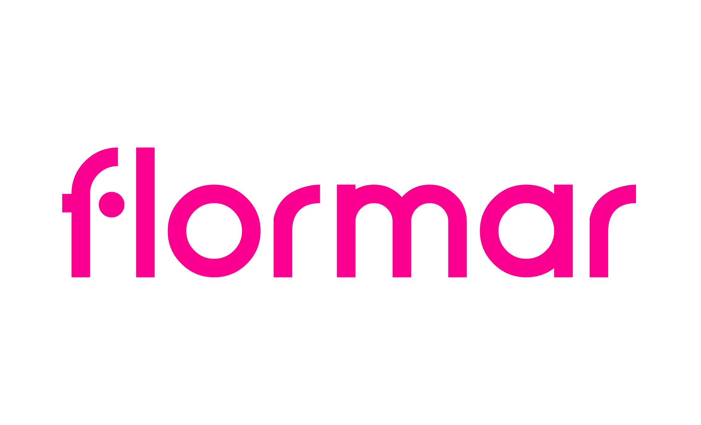
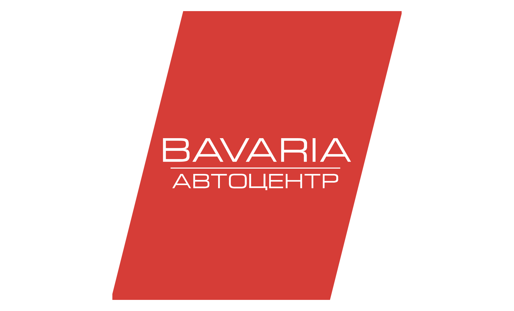
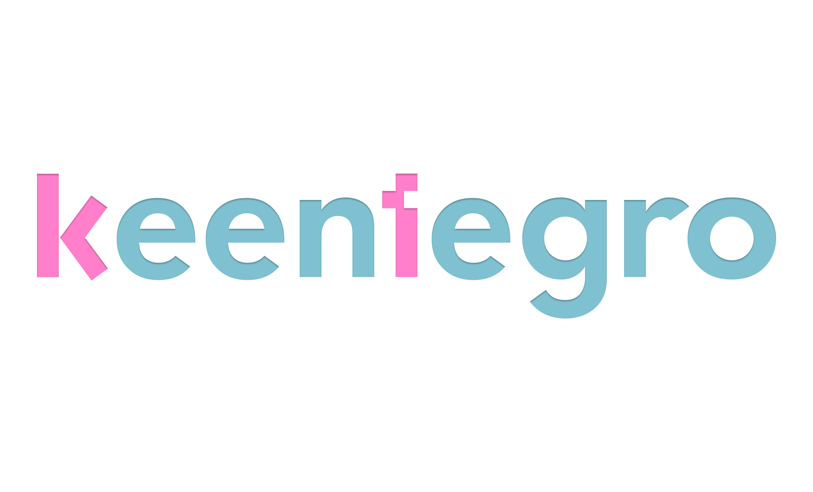

### 🦸‍♂️ Front-end / Wordpress Developer

<table>
	<tr valign="middle" align="center">
		<td>Currently mastering 📚</td>
		<td></td>
	</tr>
	<tr valign="middle" align="center">
		<td>I also like ❤️</td>
		<td></td>
	</tr>
</table>

### 💻 Tech Stack / Experience

<table>
	<tr>
		<td align="center">Frameworks</td>
		<td>
			
			
			
		</td>
	</tr>
	<tr>
		<td align="center">Languages</td>
		<td>
			
			
			
			
		</td>
	</tr>
	<tr>
		<td align="center">Compilable Languages</td>
		<td>
			
			
			
		</td>
	</tr>
	<tr>
		<td align="center">
			
			 
			Ecosystem
		</td>
		<td>
			
			
		</td>
	</tr>
	<tr>
		<td align="center">
			
			 
			Ecosystem
		</td>
		<td>
			
			
			
			
			
		</td>
	</tr>
	<tr>
		<td align="center">
			Designing Tools
		</td>
		<td>
			
		</td>
	</tr>
	<tr>
		<td align="center">
			Databases
		</td>
		<td>
			
			
		</td>
	</tr>
	<tr>
		<td align="center">
			CSS Libraries
		</td>
		<td>
			
		</td>
	</tr>
	<tr>
		<td align="center">
			Organization /  Communication
		</td>
		<td>
			
			
			
			
			
			
		</td>
	</tr>
</table>

### 📁 Portfolio

<table>
	<tr>
		<td width="25%" align="center">
			<a href="https://hsh.kiev.ua/">
				
				
Home Sweet Home

			</a>
		</td>
		<td width="25%" align="center">
			<a href="https://flormar.co.il/">
				
				
Flormar

			</a>
		</td>
		<td width="25%" align="center">
			<a href="https://bavaria.od.ua/">
				
				
Bavaria

			</a>
		</td>
		<td width="25%" align="center">
			<a href="https://www.keentegro.com/">
				
				
Keentegro

			</a>
		</td>
	</tr>
	<tr>
		<td align="center">
			<a href="https://med-spa.od.ua/">
				
				
MedSpa

			</a>
		</td>
		<td align="center">
			<a href="https://beit-grand.odessa.ua/">
				
				
Beit Grand

			</a>
		</td>
		<td align="center">
			<a href="https://grili.com.ua/">
				
				
Grili

			</a>
		</td>
		<td align="center">
			<a href="https://bellaesthetic.com.ua/">
				
				
Bella Systech

			</a>
		</td>
	</tr>
	<tr>
		<td align="center">
			
			

				<a href="http://citydom.od.ua/">Kadorr City</a> / 
				<a href="https://avcat.github.io/City-House/">GitHub</a>
			

		</td>
		<td align="center">
			
			

				<a href="http://delicate.od.ua/">Delicate</a> / 
				<a href="https://avcat.github.io/Delicate/">GitHub</a>
			

		</td>
		<td></td>
		<td></td>
	</tr>
</table>

### 🌐 You can find me in

### 📊 GitHub Stats

 

